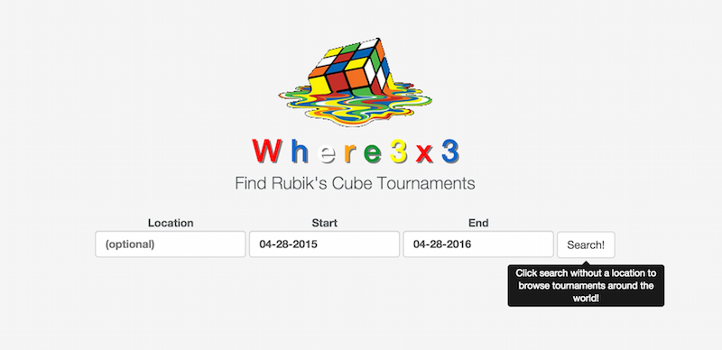

# Where3x3

[Where3x3.com][where3x3]

[where3x3]: http://www.where3x3.com/

## Description
Where3x3 is an AirBnb style, single page app used to find Rubik's Cube
tournaments around the world. The backend is built using Ruby on Rails as an API
and Backbone.js is used on the front end. The database is seeded with real
tournament data from

# Implementation

## Minimum Viable Product
- [x] Create accounts
- [x] Browse all tournaments
- [x] View tournament
- [x] Search for tournaments by location/date
- [x] Search for tournaments in map
- [ ] Sign up for tournaments
- [x] Create tournaments
- [x] View past tournaments
- [x] Seed DB with real tournament data
- [ ] User Profile Page

## Design Docs
* [View Wireframes][views]
* [DB schema][schema]

[views]: ./docs/views.md
[schema]: ./docs/schema.md

## Implementation Timeline

### Phase 1: User Authentication, Browse Tournament Index (~1 day)
I will implement user authentication in Rails based on the practices learned at
App Academy. Users will be able to sign up for accounts and log in. I will
create API routes to return the tournament index and show routes. Backbone will
be used to display the views for the main search page with the tournaments on
the left side.

[Details][phase-one]

### Phase 2: Tournament show page, site breakdown 3 main page views (~1 day)
Use backbone to create the tournament details view page. Create views for the 3
main page views, (landing, search, tournament details)

[Details][phase-two]

### Phase 3: Search (~1 day)
Implement search by location and by date range on the server side.

[Details][phase-three]

### Phase 4: Google Maps API (~2 days)
Integrate google maps API with search results

[Details][phase-four]

### Phase 5: Extract real data for seeding (~0.5 days)
Extract data from the [WCA Database](https://www.worldcubeassociation.org/results/misc/export.html) to
use as seed data.

[Details][phase-five]

### Phase 6: User Profile Page (~1 day)
Create user profile page with details and profile image

[Details][phase-six]

### Phase 7: Styling (2 days)
Style all the things

### Bonus Features (TBD)
- [X] Custom map markers
- [X] Autocomplete for addresses (https://developers.google.com/maps/documentation/javascript/places-autocomplete)
- [ ] Custom tournament urls
- [ ] Pagination/infinite scroll
- [ ] User avatars
- [ ] Super awesome Rubik's Cube CSS transitions (if possible?)
- [ ] Tournament photos
- [ ] Comments on tournaments and user pages
- [ ] Notifications (new tournaments nearby)

[phase-one]: ./docs/phases/phase1.md
[phase-two]: ./docs/phases/phase2.md
[phase-three]: ./docs/phases/phase3.md
[phase-four]: ./docs/phases/phase4.md
[phase-five]: ./docs/phases/phase5.md
[phase-six]: ./docs/phases/phase6.md
